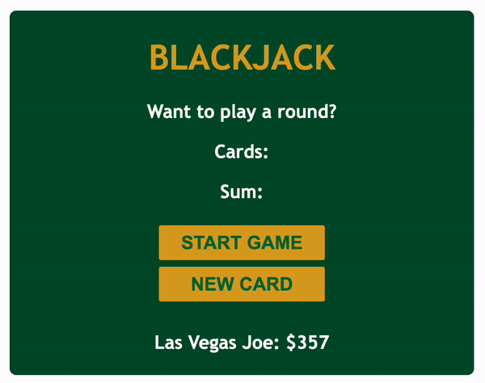

# Blackjack Game

Blackjack game build with HTML, CSS and JavaScript while learning JS basics via Scrimba platform. The game's features could be much more extensive, however, the main goal of building this project was to learn fundamentals of JavaScript.

Having built this project, I learned/reviewed the following JS topics:

- arrays
- objects
- booleans
- `if` `else` statements
- comparison operators
- logical operators
- `for` loops
- the `Math` object
- `return` statements
