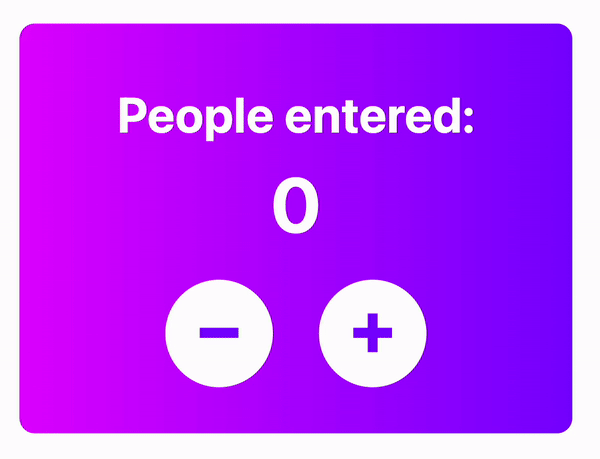

# Passenger Counter App

Basic project build with HTML, CSS and JavaScript while learning JS basics via Scrimba platform.

Having built this project, I learned/reviewed the following topics:

- JS variables, `let` vs `const`
- DOM manipulation
- Make UI more accessible by using UserWay color contrast checker

I adjusted both the functionality and UI of this project. According to this Scrimba's project instructions, students should add an increment button only, but I had decided to add a decrement functionality as well. In order to practice flexbox and web design, I also built my own UI and decided not to use the CSS styles provided by Scrimba.
